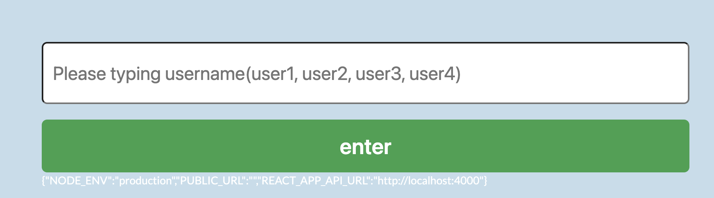
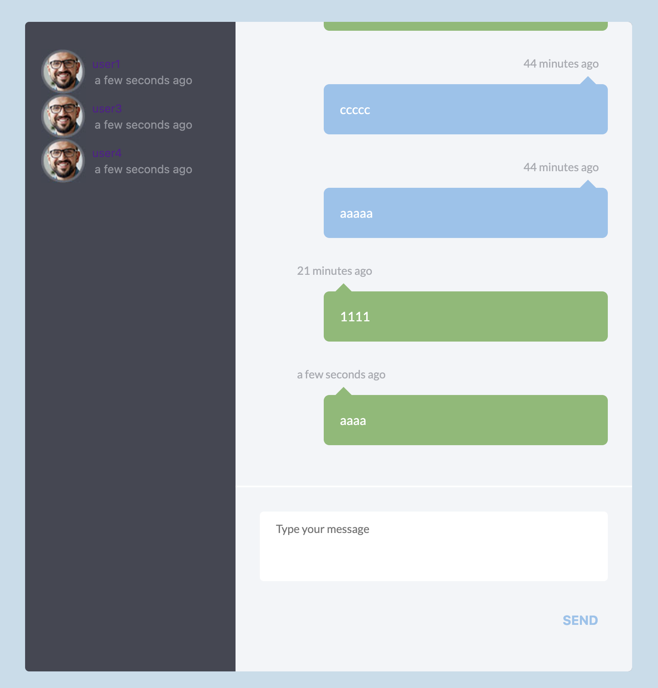

# Project chat-exam-app

## 畫面

### 輸入使用者

### 聊天室

## 開發規劃

前端介面使用網路現成樣版，其主要開發是串接 socket io，與取得用戶聊天室的 api，以達成最小測試目的為原則(介面有點陽春，聊天內容需要滑動到最底下)，用比較熟悉的 React 框架實現。

## Enviroment requiredment

    node -v  v14.16.1

## How to use?

### Install dependencies

    npm install

### Build

    npm run build

### Run

    npm run start

## 測試方式

開啟兩個瀏覽器進行測試 http://lcoalhost:3000
(請輸入 user1, user2)，進入後後端已為使用者自動建立聊天室
